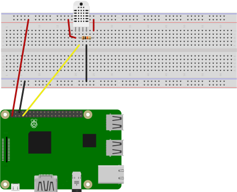
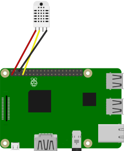
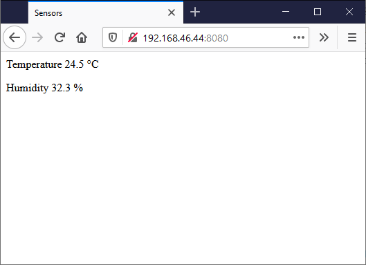

# DHT temperature/humidity web server

A simple web server for publishing readings from a DHT11/22 temperature/humidity sensor.

This application serves two purposes. The first is to show how to read data from a DHT11/22 sensor and the second is to show how to serve data using a python web server in a background thread.

Normally you would not have the web server in the same application as the data collection. Instead you would pass the data on to some data collection mechanism, for example a web API, a message queue or a database.

This example uses the Adafruit CircuitPython DHT library. See the [instructions at Adafruit](https://learn.adafruit.com/dht-humidity-sensing-on-raspberry-pi-with-gdocs-logging) for more information about it.

## Prerequisites

You need:

* A Raspberry Pi. This should work on any board with a network card, i.e. any of the model B boards or a Zero W/WH.
* Raspberry Pi OS. Install using the instructions at <https://www.raspberrypi.org/software/operating-systems/>.
* A DHT22 sensor.
* Connector wires. For connecting the sensor directly to the Raspberry Pi, use female-female connectors. For connecting to a breadboard, use female-male connectors.

Optionally:

* A resistor. This is probably already built-in to the DHT22 package, but if not then you can use a resistor somewhere in the 4.7-10 kOhm range.
* A breadboard and jump wires. If you want to wire using the resistor, then it is easiest to use a breadboard.

## Wiring

According to the specifications, the DHT22 sensor requires a pull-down resisor on its data pin. Here is a wiring diagram on how to connect this:



Since the DHT22 package often contains an internal pulldown resistor, we can simplify the wiring diagram and connect the sensor directly to the Raspberry Pi:



## Software

Make sure that the Raspberry Pi operating system is set up with network access.

### Setup

Create a new folder on the Raspbery Pi, for example `dht-web`. Change the active directory to this folder.

Copy the [dht-web.py](dht-web.py) file into the folder.

Set up the python environment and install required libraries:

```bash
python3 -m venv env
. env/bin/activate

pip3 install adafruit-circuitpython-dht
sudo apt-get install libgpiod2
```

### Run

Activate the python environment and start the application:

```bash
. env/bin/activate
python3 dht-web.py
```

Use a web browser and navigate to port 8080 on the Raspberry Pi's IP address:

`http://<IP address>:8080`

You should see the last recorded sensor readings. Reload the page to see updated values.


